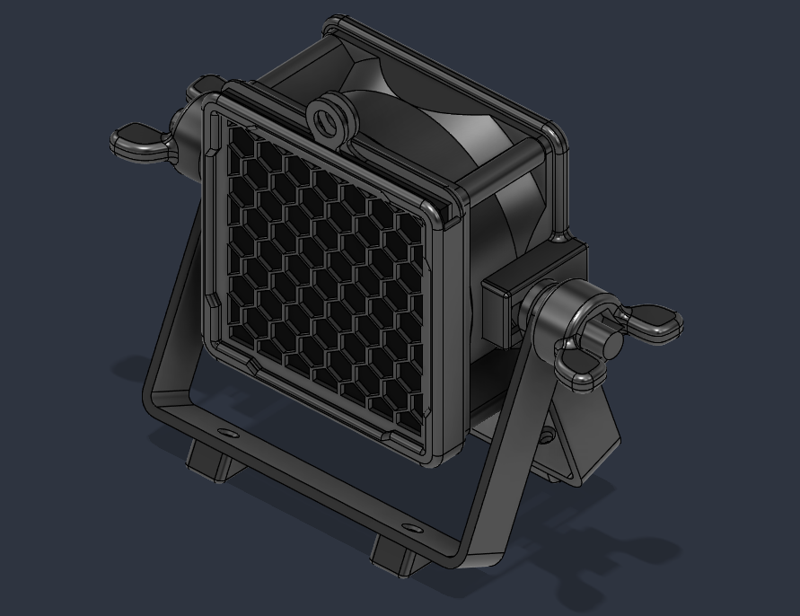
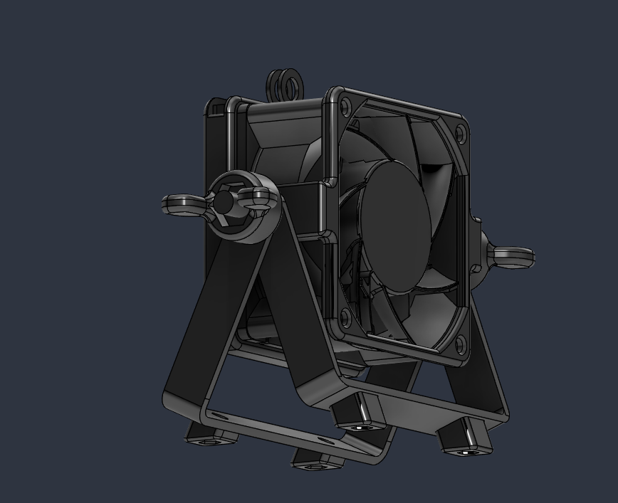
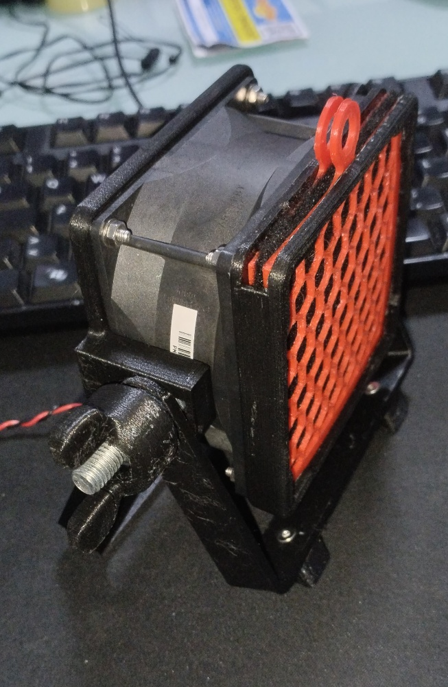
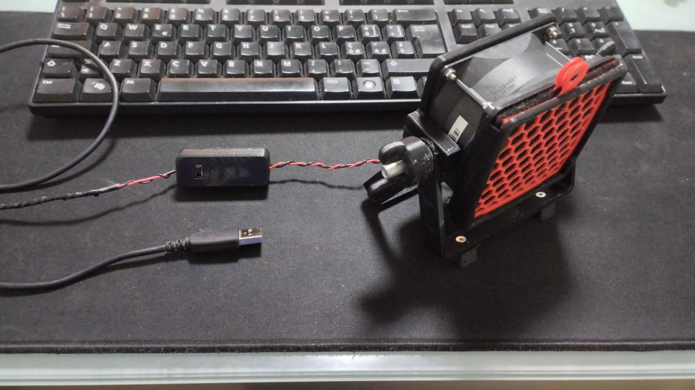

# Fume Extractor
Super Easy DIY fume extractor. The main aim of this project is to be as cheap as possible while still being a solid and useful project. 
Everything is powered via USB and through a booster module, specifically a MT3608 module and a little SPDT switch as on/off. The fan is a simple 12V fan I got from an old PC.
As a Filter i used a common active carbon filter I found in a hardware store near my house.

| Components | Quantity |
| :--- | :--- |
| 12V fan | 1 |
| mt3608 booster module | 1 |
| SPDT switch | 1 |
| M6 bolt and nut | 2 |
| Active carbon filter | 8cmx8cm |
| 1 USB cable | 1 |
| M3 screws and nuts | 12 |

You can find a demo video in the Images folder and/or at this link: https://youtu.be/QFv5RsqQFLw

